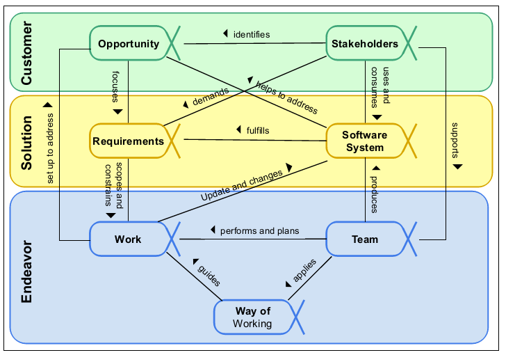
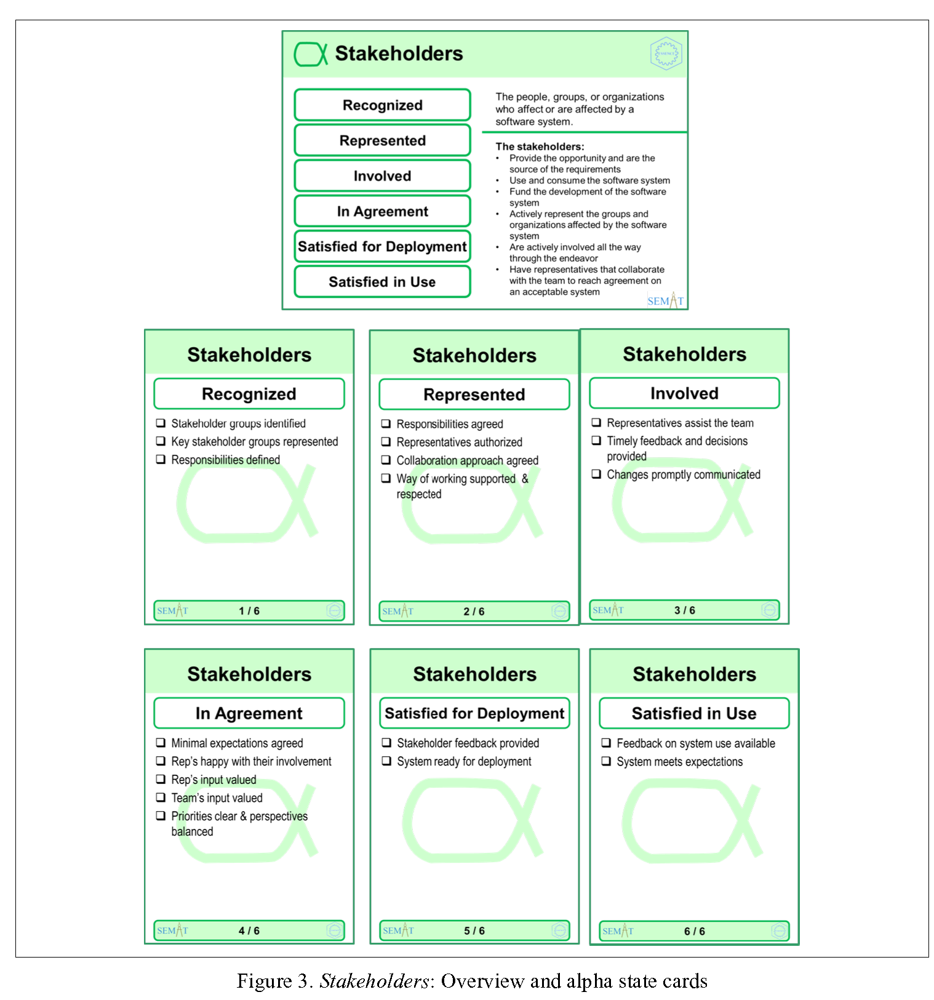

# 2. An Overview of the Alphas

The Alphas do not stand-alone but support each other. The Alphas and their relationships are shown in
Figure 2

Figure 2. The Kernel Alphas
In the customer area of concern the team needs to understand the stakeholders and the opportunity to be addressed:
    
    Customer 영역에서 관심사는 팀이 이해당사자들을 
    이해하는 것이 필요로 하고 the opportunity에 관심을 기울이는 것이
    다루는 것이 필요로 한다.
  
---

* Stakeholders: The people, groups, or organizations who affect or are affected by a software system.

        이해당사자들: 소프트 시스템에 영향을 주거나 받는 사람, 그룹, 조직들
    
    The stakeholders provide the opportunity and are the source of the requirements and funding for the software system. The team members are also stakeholders. The stakeholders should be involved throughout the software engineering endeavor to support the team and ensure that an acceptable software system is produced.

        이해당사자들은  소프트웨어 시스템을 위한 요구사항들의 원천과  기금과  
        the opportunity 를 공급한다. 
        팀원의 멤버들 또한 이해당사자이다. 이해당사자들은 팀을 지원하기 위한  
        소프트엔지니어링적인 (도처에)노력을 포함되어야 하며 ,
        (받아드릴수 있는)허용될 수 있는 소프트웨어 시스템이 공급 되도록 보장 해야 한다. 
    

* Opportunity: The set of circumstances that makes it appropriate to develop or change a software system.

        기회 : 적절하게  소프트웨어 시스템을  변화하고 개발하도록 만드는 상황들(변수들)

    The opportunity articulates the reason for the creation of the new, or changed, software system. It represents the team’s shared understanding of the stakeholders’ needs, and helps shape the requirements for the new software system by providing justification for its development.

        The opportunity 는 최신의 또는 변화된 소프트웨어 시스템의 창조에 대한 이유를 명확하게 한다. 
        The opportunity는 이해당사자들의 요구들에 대한 팀에서 공유되는 이해 나타내고 ,
        새로운 소프트웨어 개발에 대한 정당성을 부여함으로써 시스템의 요구사항들을 형상화한다.
    
    In the solution area of concern the team needs to establish a shared understanding of the requirements, and implement, build, test, deploy and support a software system that fulfills them:
    
    
* Requirements: What the software system must do to address the opportunity and satisfy the 
stakeholders.
    
        요구사항들 : 소프트웨서 시스템에서 opportunity 를 구현해야하거나 이해당사자들을 
        만족시켜야할 것들을 말한다.

    It is important to discover what is needed from the software system, share this understanding among the stakeholders and the team members, and use it to drive the development and testing of the new system.
        
        소프트웨어 시스템에서 필요로 하는것을 발견하는 것은 중요하다. 
    
* Software System: A system made up of software, hardware, and data that provides its primary value by the
execution of the software.

The primary product of any software engineering endeavor, a software system can be part of a larger software, hardware or business solution.
In the endeavor area of concern the team and its way-of-working have to be formed, and the work has to be done:

* Work: Activity involving mental or physical effort done in order to achieve a result.
In the context of software engineering, work is everything that the team does to meet the goals of producing a software system matching the requirements, and addressing the opportunity, presented by the stakeholders. The work is guided by the practices that make up the team’s way-
of-working.

* Team: A group of people actively engaged in the development, maintenance, delivery or support of a specific software system.
One or more teams plan and perform the work needed to create, update and/or change the software system.

* Way-of-Working: The tailored set of practices and tools used by a team to guide and support their work.
The team evolves their way of working alongside their understanding of their mission and their working environment. As their work proceeds they continually reflect on their way of working and adapt it as necessary to their current context.
Each Alpha has a small set of states that are used when assessing progress and health. Associated with each state is a set of pre-defined checklists. The checklists are available in an abbreviated form, as shown on the cards, and in an expanded form, along with the abbreviated form as shown in tables later in this document.

It should be noted that the states are not just one-way linear progressions. Each time you reassess a state, if you do not meet all the checklist items, you can go back to a previous state. You can also iterate through the states multiple times depending on your choice of practices.

The Alphas should not be viewed as a physical partitioning of your endeavor or as just abstract work products. Rather they represent critical indicators of the things that are most important to monitor and progress. As an example, team members, while they are part of the Team Alpha, are also stakeholders, and therefore, they can also be part of the Stakeholders Alpha. In the following sections more detailed information about each of the seven alphas is provided including full state checklists and checklist abbreviations that can also be found on the alpha state cards. It is recommended that users not use the abbreviations until they have attained a solid understanding of the full checklists. To aid the use of the Essence framework some redundant checklist items have been suppressed in the abbreviated versions.

---

# 2.1 Stakeholders

Stakeholders: The people, groups, or organizations who affect or are affected by a software system.
The stakeholders provide the opportunity, and are the source of the requirements and funding for the software system. They are involved throughout the software engineering endeavor to support the team and ensure that an acceptable software system is produced.
    
    이해당사자들 : 소프트웨어 시스템에 영향을 받거나 혹은 주는 조직, 단체, 사람들을이다.
    이해당사자들은 기회를 공급하고 소프트웨어 시스템의 요구사항의 근원이며, 자금을 제공한다.

Stakeholders are critical to the success of the software system and the work done to produce it. Their input and feedback help shape the software engineering endeavor and the resulting software system.

    이해당사자들은 소프트웨서 시스템의 성공에서 중요하고 위에 요구사항과 
    자금을 공급하여 작업을 완료한다.
    이해당사자들의 산출물과 피트백은 소트트웨어 엔지리어링 노력과 결과를 형성하는데 도움을 준다. 
    

Table 2. Checklist for Opportunity

