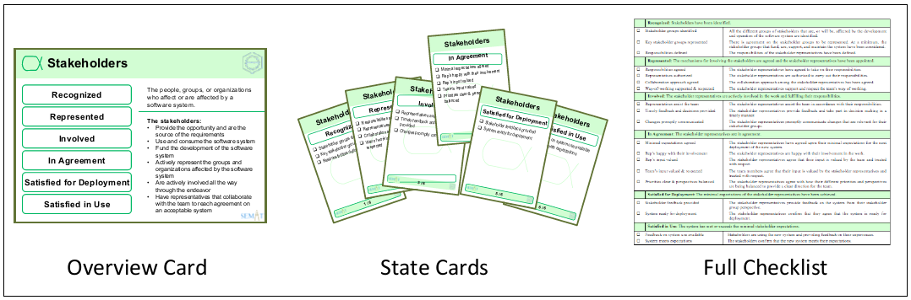

# 1. Introduction
This Quick Reference Guides provides a brief introduction to the Essence Kernel. It is designed to support the use of the Essence Cards by software development teams and, in particular, the games that can be played with them. For more detailed information see the SEMAT User Guide available from www.semat.org and the full Essence Specification available from www.omg.org.

    이 퀵 가이드는 Essence Kernel에 대한 간단한 소개를 한다. 이 가이드는 소프트웨서 
    개발팀들에 의한 에센스 카드에 대한 사용을 지원하고 ,
    부분적으로 에센스커널을 실행할수 있는 게임으로도 사용할수 있도록 디자인했다


The use of the kernel and the cards has many benefits for individuals, teams and organizations. These include helping them to:

    커널의 사용 그리고 카드의 사용은 개개인과 , 팀과 조직들에게 많은 이익을 준다. 
    그 도움을 주는 사항은 다음을 포함한다.

• Understand where they are 

    이해해라 그것들이 어디에 있는지를

• Understand what needs to be addressed 

    구현되어야 하는 것에 대한 이해 

• Track progress and health 

    과정과 상태의 추적```

• Keep projects in balance and avoid catastrophic failures

    프로젝트의 균형 유지하고 , 재앙적인 실패들 피하라

• Form good sprint goals and other objectives

    좋은 sprint 목표들과 다른 목표들을 형성하라 

• Form teams

    팀 형성하기

• Define practice independent checkpoints, milestones and lifecycles.

    독립적인 체크 포인트, 중요한 단계, 라이프사이클을 실행을 정의하라


The Kernel is both simple and incredibly powerful as it 1) captures the key concepts involved in software engineering, 2) allows the progress and health of any software engineering endeavor to be tracked and assessed, and 3) provides the common ground for the definition of software engineering methods and practices.


---

##1.1	What is Essence? Essence는 무엇인가?
Essence provides us with a thinking framework that allows teams to understand where they are and acts as a foundation for their way-of-working. At the heart of the Essence approach is the Essence Kernel – a simple state-driven model of software engineering. The Essence Kernel captures the small set of things that are universal to all software engineering endeavors; the things that a team always has to consider or work with when developing software.

    Essence는 생각의 틀을 우리에게 제공한다 팀들이 이해할 수 있도록 
    Essence Kernel 접근의 핵심은 Essence Kernel(소프트웨어 엔지리어링 단순 상태-지향) 이다. 


The kernel contains seven key elements - Requirements, Software System, Team, Work, Way of Working, Opportunity and Stakeholders. Through states defined on these elements, the kernel provides an intuitive tool for practitioners to reason about the progress and health of their endeavors in a practice- independent way. To distinguish them from the many work products used to describe them these elements are called Alphas. The Alpha view is complemented with two other views 1) a competency- based view of the skill sets the team needs to be able to do them with and 2) an activity focused view of the things that teams always have to do. By populating these views with their practices, teams can quickly assemble, analyze, and share their own way-of-working.

By focusing on the essential things inherent in all software development efforts the Essence Kernel provides a simple definition of the common ground shared by all software development teams regardless of the kind of software being developed, of how the team is organized, of what practices get selected, the size of the system being produced, and the complexity of the problem being addressed.

In summary, the Essence Kernel is a stripped-down, light-weight set of definitions that captures the essence of effective, scalable software engineering in a practice independent way. It gives us a new way to look at the domain of software engineering, a new way to understand the progress and health of our development efforts, and a new way to combine practices into an effective way-of-working. It provides a common reference model all teams can use as they continuously inspect, adapt, and improve their ways of working.


---

## 1.2	Presenting the Essence Kernel (에센스 커널의 소개)

The kernel is organized into three discrete areas of concern, each focusing on a specific aspect of software engineering, and each distinguished by the use of a different color. These are:


    Kernel은 각각 특정 소프트웨어 엔지니어링 관점을 두어 
    3개의 분리된 관심사로 구성되어있다. 그리고 각각 다른 색을 사용하여 구분된다. 
    여기에 보면

• Customer – This area of concern contains everything to do with the actual use and exploitation of the software system to be produced. The area of concern and its card are colored green.

    고객 – 이 관심사의 영역은 소프트웨어 시스템에서 산출되는 
    실제적인 사용과 개발에서 다루어지는 모든 것들을 포함한다.
    이 영역은 카드에서 초록색이다.
    
• Solution – This area of concern contains everything to do the specification and development of
the software system. This area of concern and its cards are colored yellow.

    솔루션 – 이 영역은 소프트웨어 시스템의 개발과 설계 명세사항에 대한 모든 것 들을 포함한다. 이 영역은 카드에서 노랑색이다.
    
• Endeavor – This area of concern contains everything to do with the team, and the way that they
approach their work. This area of concern is colored blue.

    노력- 이 영역은 팀과 그들의 작업에 대한 접근 방법에 대한 모든 것들을 포함한다, 이 영역은 파랑색이다.
    
Each area of concern contains a small number of:

    각각의 관심사의 영역은 작은 수를 포함한다.
    
• Alphas – representations of the essential things to work with. The Alphas provide descriptions of the kind of things that a team will manage, produce, and use in the process of developing,
maintaining and supporting software.

    알파들 - 기본적으로 작업되는 것들의 대표적인 것이다.
    알파들은 팀에서 관리하고 , 생산하고, 개발에 과정에서 사용되는 여러가지 것들에 
    대한 표현을 제공한다. 
    
• Competencies –representations of the key competencies required to do software engineering.
    
    소프트엔지리어닝에 필요한 핵심 역량(기능)에 대한 대표하는 것들이다.

• Activity Spaces – representations of the essential things to do. The Activity Spaces identify and list generic challenges a team faces when developing, maintaining and supporting software systems, and the kinds of things that the team will do to meet them.
    
    활동 영역 - 기본적으로 해야하는 대표군들. 활동 영역들은 소프트 웨어 시스템에서 개발,
    유지보수, 지원할 때 일반적으로 직면하는 도전들과 팀이 소프트웨어 시스템에서 충족될어야 할것들을 인식되고 리스트된다. 
    => 해석) 
    소프트웨어 개발할떄 직면하는 문제와 소프트웨서를 만들때 꼭 충족되야 할 문제들을 말함 
    
To make the Essence Kernel accessible and easy to use this guide presents the kernel elements in a number of complementary ways. The Alphas and Competencies are presented in overview form and as sets of cards with supporting definitions and checklists. The Activity Spaces are presented purely in overview form.

    에센스 커널에 접근하기 위해서나, 쉽게 사용하기 위해서 
    많은 상호보완적인 방법들이 있는 커널 요소들을 이 가이드는 제공하고 있다.
    Alphas 그리고 Competencies는 전반적인 형식과 정의들과 체크리스트를 지원하는 카드 세트로 주고있다.

For example, in this guide, the Alphas are presented using Alpha overview cards, Alpha state cards and full checklists. The cards and checklists used to present the Stakeholder Alpha are shown in Figure 1 below.
    
    예를 들면, 이 가이드에서는, 알파들을 overview cards, Alpha state cards 
    그리고 full checklists 를 제공한다. 카드와 체크리스트는 아래에 그림처럼 이해관계자 알파를 나타내는데 사용된다.
    


]


 


